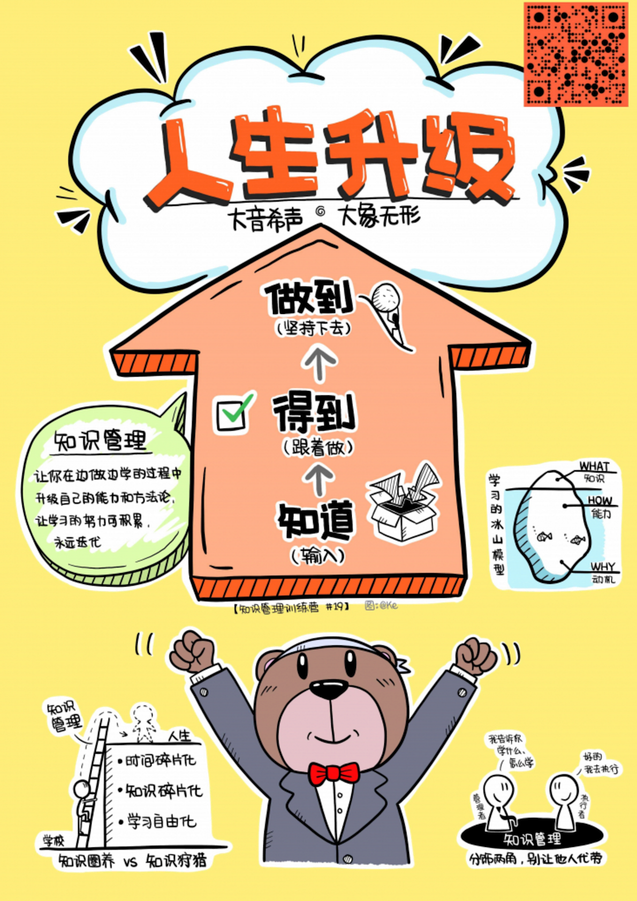
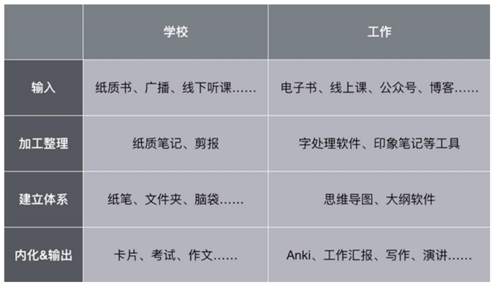
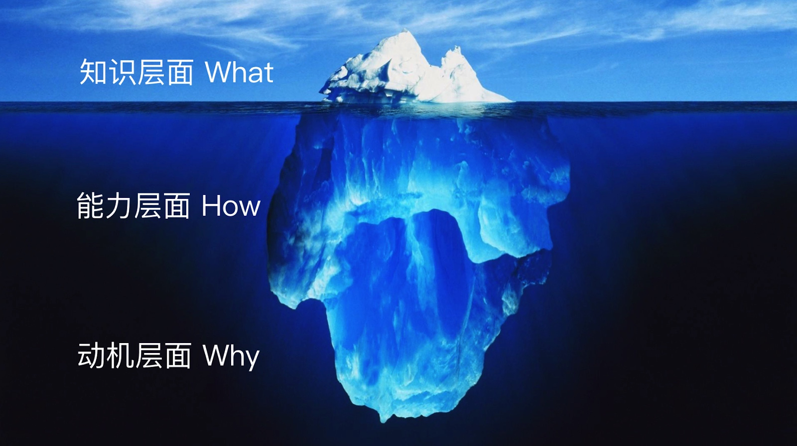
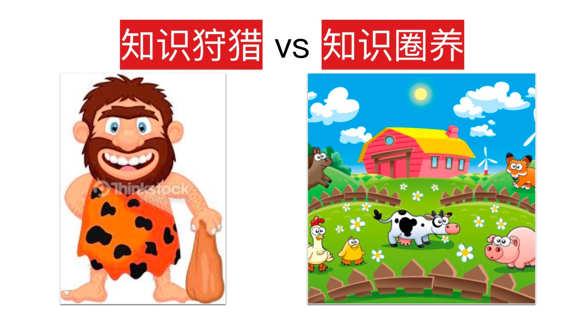
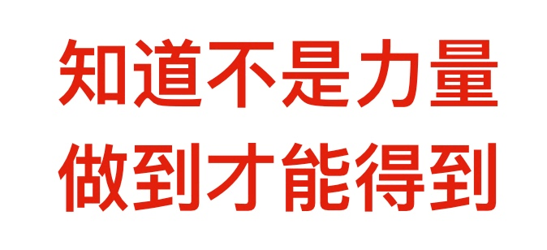

# Day19：最伟大的产品莫过于自己的人生

`21天， 我们一直在谈同一个主题， 就是「知识管理」。`

到了最后一天了， 我想问大家「知识管理 是新鲜事物吗？」

## 一、知识管理是新鲜事物吗？

只要我们在学习， 必然离不开知识管理。 从下面这个表里我们能看到……

其实知识管理并不新鲜， 我们从一年级开始就在应用着知识管理。 

只是以前在输入、加工处理、建 立体系、内化输出等环节的媒介不同，工具不一样而已，而大脑做工的本质是相同的。 

知识管理不 是新鲜事物， 无论我们有没有觉察， 它就在那里，已经伴随我们以往的学习历程十几或几十年了。 

## 二、为什么这些年知识管理才越来越被提及？

但是， 知识管理似乎这两年一下子火起来了， 被越来越多人提及、重视， 但我们在学校的时候似乎 从来也没人谈到知识管理。 
这又是为什么呢？ 

即使是学校学霸，走出象牙塔来到真实世界， 也会遇到巨大挑战。 
`考试考90分容易，但是面对现实 问题要「及格」都不容易`；
我们很「本能」地把我们在学校里养成的学习习惯、学习方法迁移到工 作中的学习，
却发现以往屡试不爽的「老办法」不再灵光，反而是屡屡碰壁。

因为： 
我们的`时间碎片化`了， 再也回不到学生时代， 有大把整块的时间供你挥霍了； 

我们的`知识碎片化了`， 再也没有人为我们制定好教学计划， 把现成的成体系的知识灌输给我们， 
面对这么多要学习的知识， 这么多干货， 我们无从下手； 

我们的`学习自由化`了， 想怎么学就怎么学， 没结果也没关系，不再像学校必然有考试的反馈环节； 

我们陷入了一种「自High式的学习」， 随着兴趣爱好学， 自己觉得自己懂就好了， 结果无法学以致用…… 

现实挑战日益增加， 个人却不能随之相应成长的时候， 焦虑必然产生。 
这其中很大的问题就是我们 的知识管理出现了问题， 老办法再也不能适应新挑战了。 
这也是为什么这些年大家越来越重视知识管理， 知识管理不断被提及，好像新生事物一样。 

## 三、2个原因导致知识管理难题

为什么我们从小都在学习， 都在运用知识管理， 但是等到我们工作的时候才遇到知识管理的难题呢？ 

为什么以前学习知识的方法不再奏效了呢？很重要的原因就是我们从来就没有建立系统性的落实到每天行动上的知识管理方法论。 
是的， 我们一直在学习具体的知识，但是我们一直就不懂得如何知识管理。 

如果我们没有学会知识管理， 那么也就不奇怪为什么我们面对工作、学习、生活的挑战，处处受挫了。 

### 3.1「知识管理」他人代劳
为什么说我们从来就没有学会知识管理呢？ 

我从两点来说， 第一， 我们虽然从小都在「亲自」学习知识，但知识管理都是别人「代劳」，别人在帮我们打理。 

1.「学什么」是`别人替我们管理`的，有固定教材，规定大纲；

2.「怎么学」是`别人替我们管理`的，「概况段落大意」，「默写全文」……

3.甚至连输出都是`别人替我们管理`的，考试所有人答的是同一份卷子， 作文也是别人命好题目的。

过去的学校教育是一种顶层设计， 而是面向所有学生千篇一律的顶层设计， 默认学生是被动学习者 的不那么高级的顶层设计。 
我们整个人都被管理着， 管理我们在哪里学， 管理我们什么时间学， 管理我们的一切。 
我们不需要动任何的脑筋， 只要去学就好了。 
所以， 在学校的时候，我 们不存在知识管理的问题，因为早有人替我们做好了知识的管理。 

我们只是像流水线上的一个工人 而已， 被这个教育流水线批量的生产着，
所有人都用一样的方式被批量生产，` 就像汽车流水线上的 一辆辆汽车， 遵循的是统一标准`。 
流水线不需要差异化， 甚至厌恶差异化，而人不是，头脑不是，遗憾的是没有人告诉我们这些，所以我们没有学会知识管理。

等到我们毕业了， 所有的知识、学习成果和过程的管理都需要我们自己操心，我们就束手无策了。 
这时候， 我们还不知道「为什么」，为什么在学校的时候我们是「学校学霸」，`为什么不能成为 「人生学霸」`。

因为， 我们在学习上的身份已经变成两个： 
    1.一个是管理者：知识管理
    2.一个是执行者：学具体知识 

如果我们依然延续以往学校时候养成的习惯， 只想做现成的「执行者」，没有实现身份的转变，学会自己来「知识管理」， 
在没有别人替我们管理的情况下，我们就可能成为了知识经济时代的 「学习焦虑症」患者。 

### 3.2「知识管理」没有人教

除此以外， 另外一个很重要的原因是，学校也没有教我们如何做知识管理。 

我们先看一个关于学习的`冰山模型`。

冰山分为三层： 

- 海面以上就是知识层面，是what
- 水面以下是 能力层面，是how
- 最底下一层是动机层面，是why

#### 3.2.1 what

我们先看看知识层面的what。

what是什么意思呢？ 

what就是说我们在学校的时候，学的具体的知识：数理化、英语、语文等等。
`这是我们学校传授的重中之重`。

但是我们仔细想想，我们现在所用到的，有多少是我们在学校里所学的呢，
我们现在学校里所学的，又有多少能够真正解决 现在的实际问题呢？

知识的更新换代那么快， `学校要教多少知识才够呢`？掌握了教材，考试就不会超纲；
但是在现实中， 我们要掌握多少知识之后， 遇到的问题才不会超纲呢？ 

what层面的知识是永远学不完的， 如果我们把有限的生命投入到无限的what的层面的知识学习，带来的必然是焦虑、无力。 
然而`学校最擅长就是传递具体的一个个知识而已`。

传统教育只教我们what，并没有告诉我们冰山底下更有价值的how。 

#### 3.2.2 how

how是什么意思？ 
how就是能力、方法论， 也就是「学会如何学习」，其中如何进行知识管理就是其中很重要的一环。 

可是这些学校里面传授吗？ 
学校看重的是我们知识掌握的多好， 我们能考多少的分数， 根本不关注 我们是如何去学的， 
我们学习的方法是不是高效， 除了知识本身以外塑造了自身的什么能力。 
当我 们学习遇到困难的时候，老师给我们的反馈往往只是更多的题海战术， 让我们要更认真，更努力而已，却没有告诉我们更加可行且落地的科学方法论。 

而真正学习的核心应该是什么呢？ 
应该是借助 学习what的实践去打造关于how的能力，去打造自己学习的方法论。 

如果我们在学校学习知识 的时候， 也顺便学会了如何学习，学会了如何管理好自己，锻炼出解决问题的能力和执行力， 那么到职场， 我们自然也很容易应对。 

所以， 我们不会知识管理的第二个重要原因， 是在以往的教育中我们没有系统地研究、探讨关于如何学习， 如何进行知识管理。

当我们没有how的时候， 面对问题， 我们就像徒手与巨龙搏斗， 场面自然非常悲壮。 
所以， 我 们这次课程， 实际上就是着眼于帮助大家打造最有价值的知识管理方法论， 让学习`科学化`。

21天训 练营中所分享的， 都是我们自己这么些年亲身实践，摸爬滚打的`血泪教训`；
我们经历过你们在 学习上的痛， 所以我们希望通过传递这些方法论， 能节省大家时间，不要重复走上同样的弯路。 

 21天知识管理方法论的探索肯定不是最终版； 
我们希望通过这样的课程， 把真正的「严肃、耐 心、不妥协」的终生学习者召集起来，
`应用这些方法去实践， 在这个基础上一起来迭代。`

这是为我们之前教育当中所缺失的进行补课， 也是能造福后来者的希望工程。
所以，知识管理不应该只是管理知识，而是应该以能力为导向，在寻求知识， 在解决问题的过
程当中去塑造自己的能力，去打造自己的方法，这也是我们这次课程中想带给大家的。

#### 3.2.3 why

冰山的最底下的一层是why。 

往往越底下的东西是越不容易发现的， 但却是在我们的学习生活中往往所起的作用又是最大的。 

`这个why就是学习的内在动机`。
你学习知识是为了什么？你进行知识 管理又是为了什么？ 

不同人的why是不同的， 它产生的效果也是不一样的。  
虽然说知识管理是how层面的， 并不涉及到 why层面的东西， 但是因为这个话题太重要了， 
所以我们在课程中也提到了托尔斯泰， 提到了他一生追寻的why，给大家分享了小能熊自己的why，我们准备穷其一生做什么事情。 

我们要如何把自己打造成产品？不要只是把自己当人生的「顾客」，使用别人的产品， 被别人的产 品影响着， 
而是要因为我们why的驱动去输出，输出自己的产品，去影响别人。 

或许这个现实的社会让我们成为了自己原本讨厌的人，让我们不惜得去考虑这些「虚无缥缈」的 why。 
我们可以不去理这些「why」，但是这些「why」却一直会理你，切实影响我们每天的生活、选择，当然也会影响我们的学习和知识管理。 

下面我们就来看看这些「why」是对知识管理的影响。 

## 四、知识狩猎 vs 知识圈养

洋快餐的肉鸡， 40多天就可以出栏。 
这些肉鸡们唯一要做的， 就是无忧无虑的全职「长肉」。 
这些肉鸡每天只要被动地接受投喂的食物，不需要主动觅食。 

而我们之前在学校的学习， 在某些层面是不是特别像这些被圈养的「肉鸡」？ 
我们被「圈养」 起来， 毫无主动性， 从来不用「主动觅食」。 

固定时间老师就会来投喂我们「知识的饲料」。 
这些 富有营养的速成「饲料」迅速将我们催肥， 我们好像每年都在成长，从一个年级升到一个年级，从 初中升到高中， 高中升到大学， 大学到硕士到博士。 
我们似乎身形见长， 因为知识的增加而变得肥硕起来。 

但是一旦离开这个舒适的鸡圈， 来到外面的世界，
要自己去「觅食」，去寻求知识，去解决问题的时候才发现，
才发现自己是胖，不是壮，肥肉多肌肉少， 知识学了很多， 没有成长为自己 的力量。

离开学校， 我们来到了真实的「问题丛林」， 唯有发挥主动性， 进行「知识狩猎」才能解决 

真实世界的问题。 再也没有现成的教材， `我们要编纂自己的教材`；
再也没有人「投喂」我们食 物， 再也不能被动地等着别人来教我们了， 而是要用费曼的精神主动去教别人； 
我们要自己打造知 识生产工具去狩猎；再也不能埋头自己吃「饲料」、啃书本了， 而是要和别人一起合作去「围 猎」； 

我们需要在狩猎的成功和失败中， 不断迭代， 不断总结， 自己动手丰衣足食了。 
这就是冰山模型里面所提到的why， 这取决于你的`主动性`。
 只有你主动去打猎的时候，你才会去主 动想办法，你才会主动去打磨你的工具，才能够更好捕猎到猎物， 才能够真正的去更好地去解决生 活中的问题。 

## 五、什么样的课程， 才是一个好的课程？

在课程的最后， 我想和大家分享我一直在思考的一个问题： 

什么样的课程才是好课程？ 

好的课程， 绝对不应该是听完了以后觉得「老师讲得真好」，「段子真幽默」， 脑子里记的尽是这 些段子了。 
而是上完这个课以后， 有一个非常强烈的冲动说， 「我要去改变」； 
并且采取了最小的 一步， 真的在行动上发生了改变； 
并且改变不是课程当下的三分钟热度， 而是「`我一直在改变`」。

这就是我们所讲的「知道-得到-做到」。 

我们在21天讲的内容是非常丰富的， 你可能只是知道而已， 或者你也是只是以为自己知道而已，
其实大家都知道， 单单知道道理并没有什么用。

课程结束以后， 如果只是停留在知道， 对大家的帮助是不会太大的。 
很重要的是「得到」， 什么是 「得到」呢， 就是按照我们的作业去做一做，
去实践实践， 你可能就会遇到问题，然后再去解决问题， 你才是`得到`。

而真正困难的是什么呢？是「做到」，是持续的去做到。 

我们去费曼一篇文章是很容易的，但能不能长年累月的不断的坚持费曼笔记，以慢为快。
你要去输出一次是很容易的， 能不能够持续的去输出呢？这其实是我们去坚持做的。
知道不是力量， 做到才能得到。

如果给课程总结为两个字， 那就是「`做到`」。

圣经上说「没有行为的信心是死的」，什么意思呢？ 你说你很有信念，但只有你的行为才能够显 示出你信念的大小、真实与否。 
同样， 一个课程， 如果只是让你认知突破是没有用的， `没有带来行为持续改变的认知突破更是死的`。

我们在这里， 为大家提供了知识管理的方法论， 补上传统教育上我们本来就应该重视， 应该学会的， 但这还不是完整的一个闭环和终点。 
我们提供的方法论不是滴滴打车， 只要你招手上车就送你到目的地 —— 听完课以后就非常轻松就学会了。 

如果学习如此轻松， 一直停在舒适区， 那不是真正的学习， 那只是售卖收获感。 而我们觉得，我们提供的知识方法论是摩拜单车，
它是一个非常高效便利的工具， 它是人人都能够轻松上手的工具，但最重要的是工具给你了，
需要你自己主动的去走完那最后的一公里，`那是别人无法替代你的那一公里`。

在我们这么多的授课经验中， 发现最难的部分不是学不会， 而是坚持不下来。 
我们不是让同学 靠热血坚持21天， 我们想让你靠梦想和对学习的执着，对知识的渴望，坚持21年。 
为了让我们在终生学习的路途不再是「孤独的远行者」， 而是能彼此搀扶， 结伴前行。 

## 六、大音希声， 大象无形

知识管理不是`目的`(ends)， 而是`工具`（means）， 我们提供的方法论， 帮助你高效的实现你的目的。

所以在课程当中， 我们也在说到， 「你要寻找自己的why」。 

用我们这套知识管理的方法， 用 到你自己的生活工作当中，并且持续地运用迭代， 就像我们课程中所说的一样，打磨你自己的产品， 
树立你自己的个人品牌，书写你自己与众不同的大象人生。 

古人说， 「`大音希声， 大象无形`」。
真正好听的音乐， 不是动次打次让我们狂乱，真正宏大的气 象， 也不是五花八门让我们目不暇接。 
当我们的思考越发清晰， 目光越发单纯，步伐越发沉稳坚定， 我们的生活也会变得越发纯粹， 越发宏大。

这次课程， `不是一个结束， 而是一个开始`。
当我们真正学会学习， 学会通过知识管理让我们学习 的努力可积累，永远迭代，
我们才从人生这所大学真正毕业，精彩才真正开始。
希望在精彩的人生 路上， 你和小能熊一路相伴， 共同前行。

## 对21天的一次复盘

知道很多道理， 却仍然过不好这一生， 因为， 道理光知道没有用， 关键要做到。  
恭喜你， 和我们一 路走到现在， 到时候一起来做一次复盘了： 

21天时间里， 你做了哪几件从前没有做过的事？ 
比如说： 
- 我第一次用软件进行知识管理， 
- 我第一次 使用笔记本代码建立体系， 
- 我第一次用费曼法学习……

## 总结 & 最小行动

- 此课程的全部视觉笔记链接：<http://t.cn/RuEov0B>