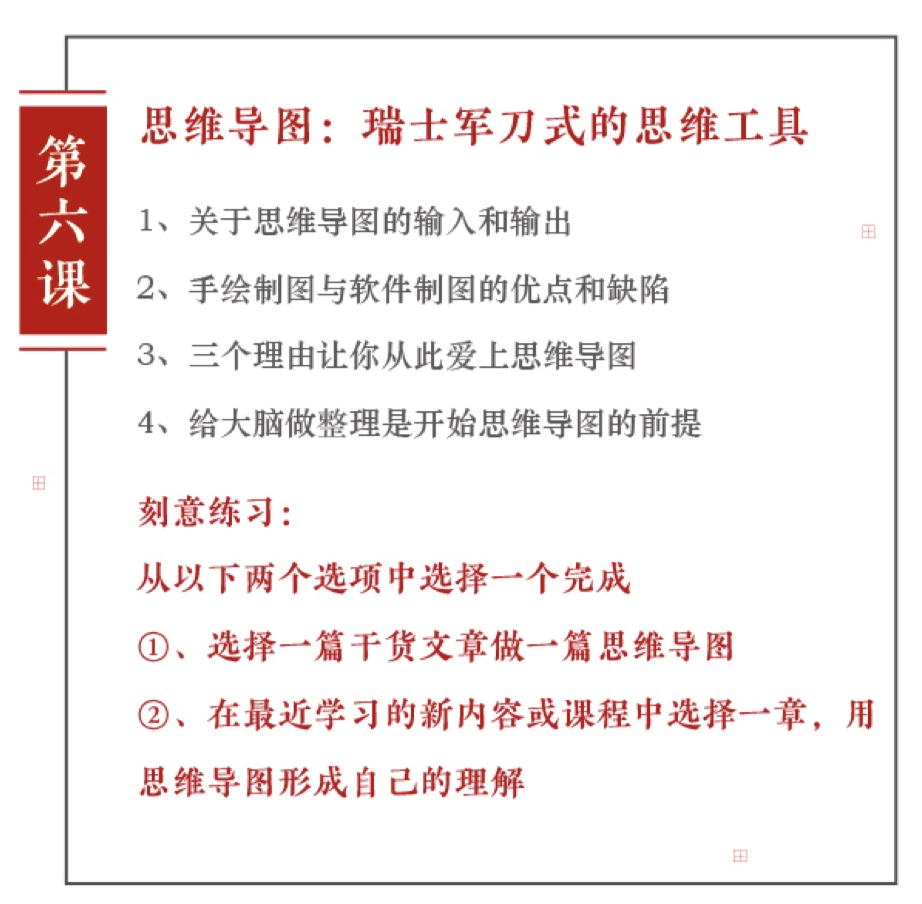

# 第六课：思维导图——瑞士军刀式的思维工具

今日要点：

我的分享将从三个部分展开的。

- 1. 什么是思维导图？
- 2. 为什么要做思维导图？
- 3. 如何做思维导图？

----

什么是思维导图呢？又被称作脑图，是发散性思维应用的一个最佳工具。
它从一个中心点展开，每个单词或者图像自身就成为一个只中心或者联想。
它可以有效地锻炼我们的可视化的思维模式。

## 1. 思维导图的输入和输出

思维导图，从`用途上`可以分为`输入和输出`两种。

- 输入起了的`记录`的作用。
比如呢，通过输入一本书的精华，或者一堂课的重点，最后整理出一份读书笔记或者课程笔记等等。

- 输出有着`思考`的作用。
比如做策划方案的时候呢，你公司同事团队成员一起做头脑风暴，可以在白板上记录一个主题，发挥人的创造和发散性思维，然后利用好思维导图这个工具能够整合每个人的想法。
最后输出一个合理的解决方案。

----

## 2. 手绘和软件制图的优缺点

思维导图，从`表现形式上`来看呢，主要分为两种，一种是`手绘`的，一种是`软件`来制作的。

### 手绘的思维导图

手绘的思维导图呢？可以调动更多的感官。
世界脑力锦标赛的创始人，教育专家，也是思维导图的发明人，`东尼博赞`曾经提出12项的原则。
其中一点就是`五官通感`，就是记忆事物的时候要伴随视觉、听觉、嗅觉、味觉和触觉。

在手绘的过程之中的我们，能够尽可能多的带动这些感官的体验。
进而加深印象，但在如今这个快节奏的生活会议和现场活动中，我们不一定能随身带着纸和彩笔。

因此，今天主要分享手围绕使用软件来制作思维导图。

### 软件制作思维导图

`软件制作`有三个`优点`的呢？
- 1. 对整体结构没有要求
- 2. 字迹没有要求
- 3. 占用空间没有要求

第一，它对`整体结构没有要求`。
画错了，不会有心理负担，可以随心所欲地调整笔记的结构和内容。
做图之前的不需要有顾虑，不担心字体大小没有控制好，上面的空间不够。
这些都可以避免掉。

第二个好处就是对于你的`字迹没有要求`，写字不够工整的人，也不用担心说害怕写错字，影响美观。
这些都会避免，很重要的一点，就是你`做完以后，别人也可以看的懂`。

不知道大家有没有这个感觉，今天看到一位朋友制作了一幅`手绘的思维导图`，字写得很好看的样子。
但是有由于练笔或者字体的原因，内容读起来不那么清晰，最后的效果，不理想的。

用软件来做思维导图就可以避免这种情况，你可以选择简单大方的字体，比如说`微软雅黑`，就会很干净，很清爽的，向人们展现你的作品。

第三个用软件做思维导图的好处就是：

你在做图的时候，对于所需要`占用的空间，不再有要求`，你不需要平整的桌面，大白纸，很多彩色笔。
你只要有电脑或者手机就可以完成。

## 3. 为什么要做思维导图？三个理由爱上思维导图

我们知道瑞士军刀是瑞士工匠精神的产物，人们赋予的瑞士军刀很多功能，剪刀，开瓶器，小刀等等。

其实思维导图就像多功能的瑞士军刀一样，能够实现很多功能，帮忙解决不同的问题。

可以运用在读书笔记，课程笔记，会议笔记等等方面。

推荐你做思维导图的原因有`三点`：

----

`第一`，它能够让`关键的概念之间的联系，更加一目了然`，把脑海之中发散性思维的脉络，`具象化`。

举个学习中的`例子`吧，我们思维导图分舵的负责人`小猫妮`。

她在学法语的时候，发现其中的很多语法跟时态很复杂。
这个时候他就会做一张思维导图，理清自己的思绪，准确判断出同一个词，不同的应用场景。

推荐你做思维导图的`第二个原因`是：
它能够`更好地建立知识与知识之间的联系`，建立好知识联系，就能够更容易加强记忆。

举个在生活中的`例子`吧，现在可能很多朋友已经接触到知识付费。
比如在得到APP上订的专栏或者在十点课堂等平台上购买了课程。

这个时候给你建议是：
在一个章节或模块结束的时候，可以通过制作一张思维导图来归纳所学习到的知识点，从中来丰富自己的知识体系。

所以，要尽量避免的是这种情况，文章我仔细读了，音频我也边做家务边听了。

然而读完听完之后没有在脑海当中留下什么内容。

那推荐你做思维导图的`第三个好处`是：
它能够`依据事物的关联性连接在一起`，帮助你更快速的加以回顾。

如何做思维导图呢？由于需要借助视频手段，因此会在后续的实战营当中展开说明。
但在这之前，我们需要对大脑进行一次`断舍离`。

----

## 4.开始做思维导图的前提

**`笔记，有一种对话的作用`**。

通过信息传递者的思维和能力，来与自身的需求和目标相结合，以此作为你`演讲者和作者之间的智力对话`。
思维导图就可以体现这个过程。

如果演讲者和作者所传达的信息，在被我们接收时，在我们的记忆阶段，就造成一定的混乱。

那么你的思维导图，就会反映出这种混乱出来。
给大脑进行断舍离这个概念，是在《`精进：如何成为一个厉害的人`》一本书所提到的。

断舍离的根本，可以说是`简化`。

简化，是清晰思考的前提，适当的简洁，意味着更丰富的内涵，把原本复杂重复的内容精简后，
头脑才能腾出空间处理其他的信息，并且进行更加复杂精微的思考。

今天，因为音频无法展现制作思维导图的全过程。
因此那我们今天留下了一个作业，供你完成。
你可以从以下两项，选择其一。

1. 从最近阅读的公号内容中选择最有收获的一篇干货文章，通过一张思维导图来进行经验总结。
2. 从最近学习的新内容或者知识付费产品中，选择一章用思维导图建立自己的知识联系。

----

欢迎你在留言区分享你所掌握的信息，或者留下你今天的心得和困惑，我会和你一起参与这场思维导图的讨论。再次感谢你跟着我一起学习如何做读书笔记，课程笔记，工作笔记，思维导图。

实现知行合一，可以用知识整理术，提高工作和生活的效率，让自己成为更优秀的人。

end~