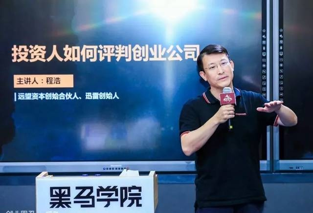
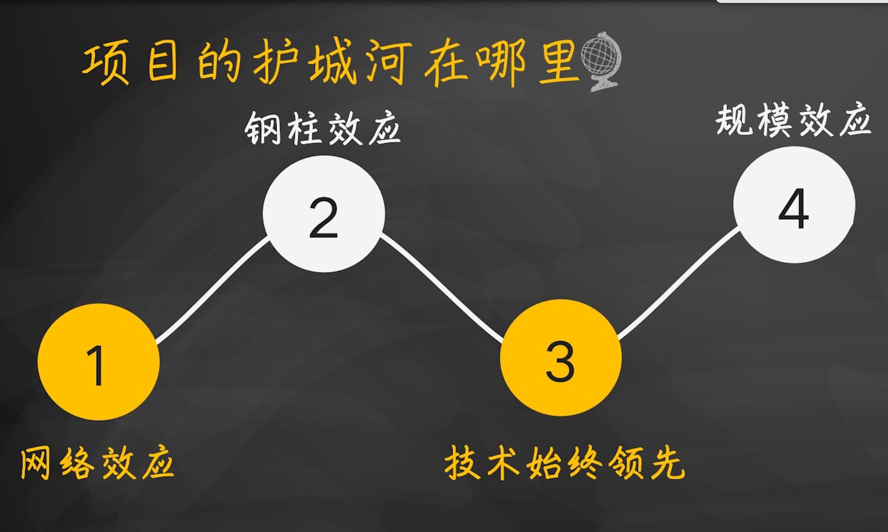

# 程浩: 投资人如何评判创业公司

[toc]

内容来源：**`2019年6月25日`**，在创业黑马主办的 **`吴世春创业心学实验室`** 第5期结业课上，远望资本创始合伙人、迅雷创始人 **`程浩`** 进行了以“`投资人如何评判创业公司`”为主题的精彩分享。

讲者|杨璐，整理人| Mr.Dragon
 

经常有人问我： **投项目的时候，主要关注哪些点，或者主要关注哪些问题？** 

`从投资人的角度`，是`怎么评判一个创业公司，怎么评判一个CEO的?`。

 

## 一、问优秀创业公司的五个问题

这五个问题对于**任何领域**来讲都一样，
`你不管做什么，核心都是回答这五个问题`。

 
### ①你做的事是不是刚需

**你做的这个事是不是刚需，是否真正解决了某个痛点？**

通常我们做一个事，一定是解决了一个需求。
没有需求，通常你也不会做。

但是，**`需求是不是刚需`**，有很大的不确定性。

什么叫 **`刚需`**？

总结就以下三点。

 

#### 1.极大提升效率
 

什么叫极大提升效率？

没有搜索引擎的时候你怎么搜东西？
有问题，没有搜索引擎怎么解决？

可以去图书馆，问朋友……。
没有搜索引擎的时候，获取信息很繁琐。
所以`搜索引擎极大提高了获取信息的效率`，提升效率，**`极大`**。

 

没有QQ时，大家怎么沟通的？写信，或者发邮件。
发邮件5分钟，收再5分钟，效率极低。
打电话也可以，不过打电话得花钱。
**QQ**的出现**极大提升**了大家 **`沟通的效率`**。

 

也包括迅雷下载，没有迅雷前下载一个东西，可能1个小时。
有迅雷可能只要10分钟，迅雷也是极大地提升了下载效率。

只要 **`能够做到极大地提升效率，那你肯定是刚需`**。

 

#### 2.极大降低成本

现在中国普遍用机器人做什么？
中国的制造业普遍在进行**机器换人**。

**`成本原因`** 是一个**最直接的原因**。

一台机器人能够代替四个人，四个人的成本一年20万。
机器人可能一年也是20万成本，但机器人能跑五年。
机器人做的东西有更好的一致性

所以，一定是 **`极大地降低了成本`**。

又比如 **`Elon Musk(埃隆·马斯克)`**，他有个公司叫`特斯拉`。

他还有家公司，叫`SpaceX`。它是专门`发射火箭`的。
它的价值在哪呢？最大的价值就是`火箭回收`技术。

所以，它解决了一个成本问题：**`极大降低成本`**。

 

#### 3.极大提升用户体验

判断是不是刚需还包括什么？**`极大提升用户体验`**。

ipad的操作简单，易上手，小孩子都能玩得很好。

这三点能够做到一个，你就已经很牛了。

#### 三点都没中的原因

你效率只提升了15%，叫**渐进式创新**。

这种**渐进式的创新**，总结就是：给大公司打工或者是给行业龙头打工。

所以要做一定的是**颠覆式创新**。

 

#### 为什么一定要用极大

- 智能手表
  - 新消息提醒
  - 测量健康指标

- 智能手机
  - 大屏幕
  - 功能多

可能20多个人曾用过智能手表，但今天在用的只有2、3个人。
而手机现在大家都在用，这就体现了一个巨大的差异。

 

### ②市场有多大,未来趋势是什么

第二个问题就是：**`市场有多大？`**

通常对于专业投资人来讲，需要一个至少几百亿人民币的市场。
有的时候如果你讲的市场容量太小，可能投资人都没有兴趣听你往下讲了。

还有就是 **`未来的市场趋势是什么`** 也非常重要。

比如做**`工厂的蓝领招聘`**的。
每年春节之后，因为返乡的有早有晚，所以招人挺难的。
但我觉得这个事可能长期来讲不是大趋势。
最核心的是：机器换人这个趋势是很明显的。

还有做 **`立体停车场`的**
用立体的方式可以停更多车。
但这事长期趋势不对。
国家鼓励你去坐公交、地铁，各大城市都在坐地铁。

未来趋势是：**`自动驾驶`**。
自动驾驶出来，大多数的人可能不自己买车了，而是直接按需用车。
大家都不买车了，那么多停车场有什么用？
而且立体停车场，投入还挺大的。

所以要做一定要做 **`容量够大，而且符合大趋势的市场`**。
这是创业者要非常关注的。

 

### ③你的商业模式怎么赚钱？

通常有几种：

- 有增值服务。
- 有足够的毛利。

试着回答这几个问题：
- **1.假设你去`创业`，那你`有几类收入`？**
- **2.你的`主营收入`是哪类？**。

如果你是做硬件的、做服务的，你要说清楚：
你的毛利是多少，收支平衡线在哪里？

如果你是抢占入口型的，你就得说清楚：
羊毛出在猪身上，那到底谁是猪？

 

### ④为什么是你做这个事？

前几个都是跟 **`事`** 有关系，第四个就是**非常核心**的一点：跟 **`人`** 有关系。

- **`为什么是你做这个事，不是我做这个事？`**。

最常见的：
1. 行业耕耘多年，突然发现一个细分机会。
2. 公司没有创新精神，或者老板不同意，我应该自己试一试。

这一类是最典型的创业动机。

 

#### 你为什么要创这个业？

创业之前一定要问自己这个问题：**`你为什么要创这个业？`**

如果你只是一个机会主义者，或者是风口论者，只是因为这事热闹才创业，那是很危险的。因为这个风口早晚得过。

- 2016年我觉得VR特别火，当时看了很多VR项目，还好我们当时没投。
- VR到2018年的时候已经完全不行了，只因为火去创业的公司一定会散。

如果你是因为你非常热爱这个行业，你深深地相信在这个行业最终一定会起飞。
那就可以持续坚持下去。

**总结**：
- 一定得问自己做这个事的 **`初心是什么`**？
- 你为什么做这个事情，**`决定了你未来能否坚持下去`**，这是最核心的原因。

所以通常为什么是我做，而不是你做，有以上几种可能性。
大家都能做的项目，不是什么好投资机会。

 

### ⑤项目的护城河在哪里

创业者比较容易忽略的问题就是：**`项目的护城河在哪里`？**。

事实上中国绝对不乏创业者。
那你怎么稳操胜券，你做的这个事，未来3个月人家超越不了你？

也就是 **`壁垒在哪儿`**？

护城河通常有几类，我们一个个讲。

 
#### 1.网络效应

在互联网这个行业，**`最有效的护城河是网络效应`**。

- 强网络效应

    - 微信一旦火起来，所有的社区社交都做不起来。
    
    大家知道**网易推过易信，阿里推过来往**，都做不起来，因为这是**强网络效应**。
 

    我好友都在微信上，我一个人用阿里的来往，这事没有意义。
    我不可能把我的朋友都叫过来。

 

- 双边网络效应
    - 滴滴有比较明显的网络效应，那滴滴的缺点是：区域化程度太高了。
    - 滴滴打车的网络效应在哪儿呢？
        - 越多的司机 会 带来越多的乘客，因为车多乘客等的时间就短，体验就好。
        - 更多的乘客会带来更多的司机，因为司机能赚到钱。

**事实上所有的市场、交易平台都是有比较明显的网络效应的。**

 
#### 2.钢柱效应

我买了一套CRM系统，我用了一年有人找我说比我现在用的便宜20%，你愿不愿意体验一下？

> CRM（客户关系管理）

我好不容易安装这套系统、把系统用熟了、把数据全放这上面了。
让我迁移到另外一套系统上，我觉得太麻烦。

便宜20%，后面会不会收取别的 增值服务费 ？
可用性高不高？未来服务要不行怎么办？一堆考虑。

**钢柱效应**，就是说它 **`迁徙的难度是比较大`** 的。

我不会因为另外一个公司比你有一些好的改善，我就直接迁到另外一个公司。

 
#### 3.技术始终领先

第三，**`技术始终领先`**，这个是**最难的**、**最有效的**。

**大疆**的产品做的好、稳定性是最好的。

大疆对于竞争对手的 **`优势`** 是：它技术始终跑在你前面。

- 1.你推出一个跟大疆竞争的产品，同样配置价格却便宜些，大疆怎么反击的？
- 2.立刻 **推出一个更高型号的，全面超越我的性能，同时价格比你还便宜！** 

 

#### 4.规模效应

规模效应最典型的是：**半导体**

大家知道半导体的投入也非常大，半导体它的初始投资特别大，**流片**这个成本很高，但是一旦流片成功的，你做一个的边际成本几乎为零。

> Tape Out（流片）：像流水线一样通过一系列工艺步骤制造芯片。

但**前提是**你必须能保证你的销售规模足够大，那边际成本就几乎忽略不计了。

换句话说：
- 如果这一个市场只有一家做，这家非常赚钱。
- 只有两家做，第一家很赚钱，第二家也比较赚钱。
- 如果10家做都是同样的市场，所有人都不赚钱，这是它的规模效益导致的。

所以说创业者要建护城河的话，可能是以上讲的4个之一。

如果你发现**你做的事没有护城河，这个事是非常值得你思考的事情，意味着你这个钱赚不长久。**

 

## 二、一句话讲清楚你的商业模式

**`凡是一句话讲不清楚的创业者都是没讲清楚`**。

所有的生意都必须要一句话讲清楚。

大多数人都讲不清楚，为什么说这句话特别重要呢？

大家听说过有个 elevator pitch。

> 电梯法则，即**用极具吸引力的方式简明扼要地阐述自己的观点**。
> 也被称为电梯游说（Elevator pitch）。

我想卖东西给你，但你说太忙，说在电梯上，把事给你讲清楚。
如果你讲不清楚，通常都是你自己没有想清楚。

其实对于大公司来讲也是一样的：
 **`纳德拉`** 刚上任微软CEO时，把微软的商业核心精确成中文是7个字：
- **`移动为先、云为先`**。

移动为先，10几万人的企业这么多 business( 业务 )，精炼出来就7个字：
- 移动为先、云为先。

英语就4个字：
- **`mobile  first，cloud  first`**。

再 review 一下刚说的5个问题：

- 1. 是不是刚需
- 2. 市场空间有多大
- 3. 怎么赚钱
- 4. 为什么是你
- 5. 竞争壁垒是什么

这5个问题不仅仅是投资人要问你的，更是创业之前要自己问自己的。

通常来讲，二次创业的人会对这个问题会有更深的思考，不管你过去第一次创业是成功还是失败。

 

## 三、怎样的CEO最受投资人欢迎？

**越早期**的项目， **人** 的比例越高。
**越后期**的项目， **事** 的比例越高。

腾讯投资京东时，京东都做这么大了，就别怀疑人家东哥能力了，
从做生意来讲是没问题的。

通常我们判断CEO，有几个比较重要的标准，我完整的把甲方的套路告诉你们。

这 **`4点我觉得不分顺序`**，不分哪个更重要，哪个不重要，都很重要，我只是按照顺序讲。

 

### ①领导力

第一点是 **`领导力`**。

领导力最核心的就是一个**巨人的能力**。
领导力怎么看呢？

咱俩聊2个小时，你能够 **`打动`** 我，意味着你能够打动别的投资人，意味着你能够打动你的客户，打动你的合伙人，打动你的员工，就叫领导力。

- 根据这个人聊天的气场，可以明显感受出来这人的领导力。
- 如果是连续创业者，你以前那些伙计愿不愿意跟你在一起。
- 如果以前是在BAT做高管，你出来之后能不能带走几个人马。一个都带不出来，我们会觉得有一点怀疑。

领导力很重要。

 

### ②创业精神

大家知道创业就是过九九八十一难，你如果没有创业精神，其中任何一难把你挡住了，你可能就算了。

你必须得有**足够的动力，足够的创造的决心，你才能真正最后走到成功**。

 
### ③执行力

第三，**`执行力`**。

执行力这个毋庸置疑了，CEO是什么简称？
> Chief Executive Officer，首席**执行**官。

执行力是极其重要的，我们怎么看一下CEO的执行力?

我们有很多小技巧，这些都是甲方的思考，今天传授给你们。

举个例子：
- 聊天中故意提及认识招商银行的人，你看他事后会不会找你。

  1. 看他是否现场要求联络？
  2. 我当时确实比较忙，我忘回他了
  3. 看他继续跟不跟你，他再跟我发微信，我拉完之后我也不理他
  4. 大概过个1周以后，我会问一下我朋友，我说我那天拉的哥们儿跟你有联系吗？
       - 他说就聊了一下就没动静了，这是一种可能性。
       - 他第二天就约我，第三天就跑过来了，这是另外一种可能性。

这就是**执行力的差别**。

 

### ④学习能力

第四： **`学习能力`**。

阿里的创新基本上3、5年就一波大的。

2014年推了一个淘宝，然后淘宝带起了支付宝，后来的天猫。

现在支付宝又分出来蚂蚁金服，又搞了芝麻信用。

还有2009年搞的阿里云，现在的菜鸟物流、钉钉、盒马鲜生。

阿里这种 **`持续性创新`** 的公司真的是非常少见。

 

总结：
- **`做到千亿美金的公司必须得有四波，如果没有四波做不到千亿美金。`**

腾讯显然不止四波，阿里不止四波，头条基本接近四波。

内涵段子、今日头条、抖音、国际化，基本上四波。

 

所以如果 CEO 没有很好的学习能力，这个公司一定是不可能做大的。

 
#### 怎么判断CEO的学习能力

- **学历高不高**

    北大、清华出来的，或者斯坦福、麻省理工出来的，
    你可以认为他学习能力过关，否则这个人考不上。
        
    他学数理化能学的很好，你认为他学商业也能学的很好，
    会对他更有这样的信心。

    它是充分，但不必要条件。

比较粗糙的标准：
- **1. 你的学历怎么样，你是哪个学校毕业的**。
- **2. 升职快不快**

 

### 总结

1. **领导力**是最容易判断的；
2. **创业精神**也很容易判断:
    - 你说你有没有创业精神，你给我们讲讲你为什么创这个业，你告诉我你过去的历史。
    - 如果你连续创业，这也很容易判断，你说说你有没有领导力。

3. **执行力**，我们也有小的判断标准；

4. **`最难判断的就是：学习能力。`**

你的学习能力，只是停留在一个低水平的话：

你可能有机会做成10亿美金的公司，
但是你能做成100亿美金的公司吗？

我觉得这个是 **最需要关心的点**。

 

今天就跟大家分享到这里，谢谢大家！

 